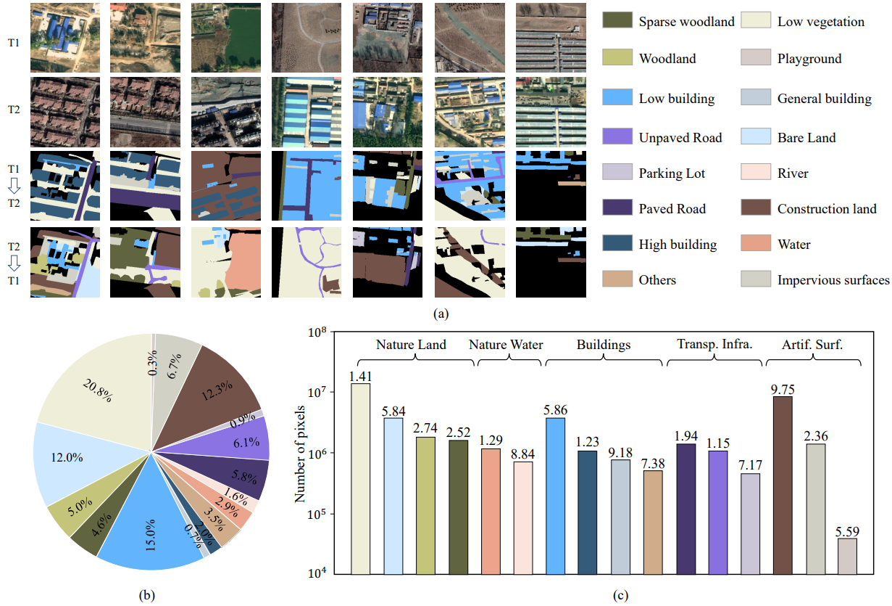
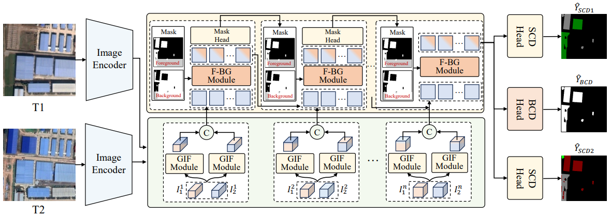

<div align="center">

<h3>FoBa: A Foreground-Background co-Guided Method and New Benchmark for Remote Sensing Semantic Change Detection</h3>

[Haotian Zhang](https://scholar.google.com/citations?user=c7uR6NUAAAAJ&hl=zh-CN)<sup>1</sup>, Han Guo<sup>1</sup>, Keyan Chen<sup>1</sup>, Hao Chen<sup>2</sup>, Zhengxia Zou<sup>1</sup>, Zhenwei Shi<sup>1, *</sup>

<sup>1</sup>  Beihang University,  <sup>2</sup> Shanghai Artificial Intelligence Laboratory.

<sup>*</sup> Corresponding author


[](https://ieeexplore.ieee.org/stamp/stamp.jsp?tp=&arnumber=11268372)  [](https://arxiv.org/abs/2509.15788)

[**Overview**](#overview) | [**Get Started**](#%EF%B8%8Flets-get-started) | [**Taken Away**](#%EF%B8%8Fresults-taken-away) | [**Others**](#q--a)

</div>

## 🛎️Updates
* **` Notice`**: FoBa has been accepted by [IEEE TGRS](https://ieeexplore.ieee.org/document/11268372)! We'd appreciate it if you could give this repo a ⭐️**star**⭐️ and stay tuned!!

* **` November 18th, 2025`**: FoBa has been accepted by [IEEE TGRS](https://ieeexplore.ieee.org/document/11268372)!!

## 🔭Overview

* [**FoBa**](https://ieeexplore.ieee.org/stamp/stamp.jsp?tp=&arnumber=11268372) serves as a strong benchmark for semantic change detection tasks. 

* **The LevirSCD dataset**
<p align="center">
  
</p>

* **The architecture of FoBa**

<p align="center">
  
</p>


## 🗝️Let's Get Started!
### `A. Installation`

Note that the code in this repo runs under **Linux** system. We have not tested whether it works under other OS.

The repo is based on the [VMama repo](https://github.com/MzeroMiko/VMamba) and [ChangeMamba repo](https://github.com/ChenHongruixuan/ChangeMamba), thus you need to install it first. The following installation sequence is taken from the VMamba repo. 

**Step 1: Clone the repository:**

Clone this repository and navigate to the project directory:
```bash
git clone https://github.com/zmoka-zht/FoBa.git
cd FoBa
```


**Step 2: Environment Setup:**

It is recommended to set up a conda environment and installing dependencies via pip. Use the following commands to set up your environment:

***Create and activate a new conda environment***

```bash
conda create -n foba
conda activate foba
```

***Install dependencies***

```bash
pip install -r requirements.txt
cd kernels/selective_scan && pip install .
```


***Dependencies for "Detection" and "Segmentation" (optional in VMamba)***

```bash
pip install mmengine==0.10.1 mmcv==2.1.0 opencv-python-headless ftfy regex
pip install mmdet==3.3.0 mmsegmentation==1.2.2 mmpretrain==1.2.0
```
### `B. Download Pretrained Weight`
Also, please download the pretrained weights of [VMamba-Tiny](https://drive.google.com/file/d/160PXughGMNZ1GyByspLFS68sfUdrQE2N/view?usp=drive_link), [VMamba-Small](https://drive.google.com/file/d/1dxHtFEgeJ9KL5WiLlvQOZK5jSEEd2Nmz/view?usp=drive_link), and [VMamba-Base](https://drive.google.com/file/d/1kUHSBDoFvFG58EmwWurdSVZd8gyKWYfr/view?usp=drive_link) and put them under 
```bash
project_path/FoBa/pretrained_weight/
```

### `C. Data Preparation`
***Semantic change detection***

The [SECOND dataset](https://captain-whu.github.io/SCD/) is used for semantic change detection experiments. Please download it and make it have the following folder/file structure. Note that **the land-cover maps are RGB images in the original SECOND dataset for visualization, you need to transform them into single-channel**. Also, **the binary change maps should be generated by yourself** and put them into folder. 

Or you are welcome to directly download and use our **preprocessed SECOND, LevirSCD, JL1 dataset** from the following links:
- **Baidu Netdisk:** [Download link](https://pan.baidu.com/s/11mcbilrctWH02sazZEt3Xg)  
  **Extraction code:** `foba`  

```
${DATASET_ROOT} # Dataset root directory, for example: /home/username/data/SECOND
├── train
│   ├── im1
│   │   ├──00001.png
│   │   ├──00002.png
│   │   ├──00003.png
│   │   ...
│   │
│   ├── im2
│   │   ├──00001.png
│   │   ... 
│   │
│   ├── label   # Binary change map
│   │   ├──00001.png 
│   │   ... 
│   │
│   ├── label1   # Land-cover map of T1
│   │   ├──00001.png 
│   │   ...  
│   │
│   └── label2   # Land-cover map of T2
│       ├──00001.png 
│       ...  
│   
├── test
│   ├── ...
│   ...
├── list 
│   ├──train.txt
└── ├──test.txt
```

### `D. Model Training`
Before training models, please enter into [`changedetection`] folder, which contains all the code for network definitions, training and testing. 

```bash
cd <project_path>/FoBa/changedetection
```
***Semantic change detection***

The following commands show how to train and evaluate FoBa on the SECOND dataset:
```bash
python script/train_foba.py  --dataset 'SECOND' \
                                 --batch_size 2 \
                                 --crop_size 512 \
                                 --max_iters 480000 \
                                 --model_type FoBa \
                                 --model_param_path '<project_path>/FoBa/changedetection/saved_models' \ 
                                 --train_dataset_path '<dataset_path>/SECOND/train' \
                                 --train_data_list_path '<dataset_path>/SECOND/list/train_list.txt' \
                                 --test_dataset_path '<dataset_path>/SECOND/test' \
                                 --test_data_list_path '<dataset_path>/SECOND/list/test_list.txt'
                                 --cfg '<project_path>/FoBa/changedetection/configs/vssm1/vssm_small_224.yaml' \
                                 --pretrained_weight_path '<project_path>/FoBa/pretrained_weight/vssm_small_0229_ckpt_epoch_222.pth'
```
### `E. Inference Using Our/Your Weights`

Before inference, please enter into [`changedetection`] folder. 
```bash
cd <project_path>/FoBa/changedetection
```

***Semantic change detection***

The following commands show how to infer semantic change maps using trained MambaSCD-Tiny on the SECOND dataset:
```bash
python script/infer_foba_second.py  --dataset 'SECOND'  \
                                 --model_type 'FoBaMambaBased' \
                                 --test_dataset_path '<dataset_path>/SECOND/test' \
                                 --test_data_list_path '<dataset_path>/SECOND/list\test_list.txt' \
                                 --cfg '<project_path>/FoBa/changedetection/configs/vssm1/vssm_base_224.yaml' \
                                 --pretrained_weight_path '<project_path>/FoBa/pretrained_weight/vssm_base_0229_ckpt_epoch_237.pth'
                                 --resume '<saved_model_path>/[your_trained_model].pth'
```


## ⚗️Results Taken Away


* *We'd appreciate it if you could give this repo a ⭐️**star**⭐️ and stay tuned.*

### `A. Pretrained Weight of VMamba (Encoder)`

| Method | ImageNet (ckpt) | 
| :---: | :---: |
| VMamba-Tiny | [[GDrive](https://drive.google.com/file/d/160PXughGMNZ1GyByspLFS68sfUdrQE2N/view?usp=drive_link)]    
| VMamba-Small | [[GDrive](https://drive.google.com/file/d/1dxHtFEgeJ9KL5WiLlvQOZK5jSEEd2Nmz/view?usp=drive_link)] 
| VMamba-Base |  [[GDrive](https://drive.google.com/file/d/1kUHSBDoFvFG58EmwWurdSVZd8gyKWYfr/view?usp=drive_link)]

### `B. Semantic Change Detection`
| Method | Checkpoints |
| :---: | :---: |
| FoBaMambaBased | [SECOND + LevirSCD + JL1](https://pan.baidu.com/s/11mcbilrctWH02sazZEt3Xg) (**Extraction code:** `foba`)
| FoBaTransformerBased | [SECOND + LevirSCD + JL1](https://pan.baidu.com/s/11mcbilrctWH02sazZEt3Xg) (**Extraction code:** `foba`)

## 📜Reference

If this code or dataset contributes to your research, please kindly consider citing our paper and give this repo ⭐️ :)
```
@ARTICLE{11268372,
  author={Zhang, Haotian and Guo, Han and Chen, Keyan and Chen, Hao and Zou, Zhengxia and Shi, Zhenwei},
  journal={IEEE Transactions on Geoscience and Remote Sensing}, 
  title={FoBa: A Foreground-Background co-Guided Method and New Benchmark for Remote Sensing Semantic Change Detection}, 
  year={2025},
  volume={},
  number={},
  pages={1-1},
  keywords={Semantics;Remote sensing;Transformers;Feature extraction;Annotations;Roads;Multitasking;Spatial resolution;Landsat;Land surface;Semantic change detection (SCD);foreground-background co-guided;bi-temporal interaction;mamba;new benchmark},
  doi={10.1109/TGRS.2025.3636947}}

@ARTICLE{10902569,
  author={Zhang, Haotian and Chen, Keyan and Liu, Chenyang and Chen, Hao and Zou, Zhengxia and Shi, Zhenwei},
  journal={IEEE Transactions on Geoscience and Remote Sensing}, 
  title={CDMamba: Incorporating Local Clues Into Mamba for Remote Sensing Image Binary Change Detection}, 
  year={2025},
  volume={63},
  number={},
  pages={1-16},
  keywords={Feature extraction;Transformers;Remote sensing;Convolutional neural networks;Visualization;Artificial intelligence;Spatiotemporal phenomena;Computational modeling;Attention mechanisms;Computer vision;Bi-temporal interaction;change detection (CD);high-resolution optical remote sensing image;Mamba;state-space model},
  doi={10.1109/TGRS.2025.3545012}}

@ARTICLE{10471555,
  author={Zhang, Haotian and Chen, Hao and Zhou, Chenyao and Chen, Keyan and Liu, Chenyang and Zou, Zhengxia and Shi, Zhenwei},
  journal={IEEE Transactions on Geoscience and Remote Sensing}, 
  title={BiFA: Remote Sensing Image Change Detection With Bitemporal Feature Alignment}, 
  year={2024},
  volume={62},
  number={},
  pages={1-17},
  keywords={Feature extraction;Task analysis;Remote sensing;Transformers;Interference;Decoding;Optical flow;Bitemporal interaction (BI);change detection (CD);feature alignment;flow field;high-resolution optical remote sensing image;implicit neural representation},
  doi={10.1109/TGRS.2024.3376673}}
```

## 🤝Acknowledgments
This project is based on VMamba ([paper](https://arxiv.org/abs/2401.10166), [code](https://github.com/MzeroMiko/VMamba)), ChangeMamba ([paper](https://ieeexplore.ieee.org/document/10565926), [code](https://github.com/ChenHongruixuan/ChangeMamba)). Thanks for their excellent works!!

## 🙋Q & A
***For any questions, please feel free to [contact us.](haotianzhang@buaa.edu.cn)***

